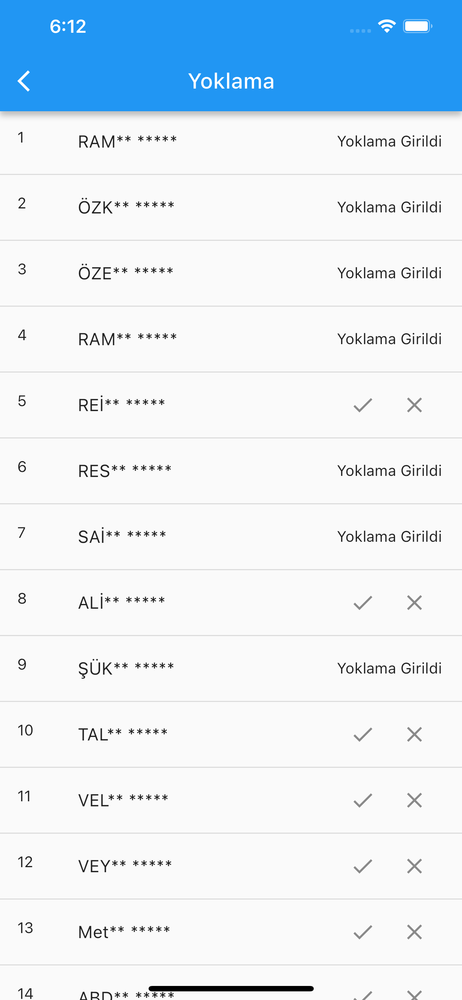

# Toplantı Yoklama Uygulaması

Flutter ile yazdığum uygulama, toplantıları yönetmek ve katılımcıları takip etmek için kullanabileceğiniz bir araçtır. Bu README dosyası, uygulamanızı nasıl kullanacağınızı ve geliştirmeniz gereken adımları anlatmaktadır. 

## Proje Hakkında

Bu Flutter mobil uygulaması, toplantıları yönetmek ve katılımcıları takip etmek için tasarlanmıştır. Supabase adlı bir backend servisi ile veri saklama ve işleme işlevleri kullanılmıştır.

Bu uygulama, toplantıların yoklamasını almak, katılımcıları kaydetmek ve raporlar oluşturmak için tasarlanmıştır. Temel işlevler şunlardır:

- Yeni toplantılar oluşturabilir ve her toplantı için katılımcıları kaydedebilirsiniz.
- Önceki toplantılarda kimin katıldığını ve kimin katılmadığını görüntüleyebilirsiniz.
- Kişi bazlı olarak, hangi toplantılara katıldıklarını ve katılmadıklarını görüntüleyebilirsiniz.
- Yeni kişileri ekleyebilir ve mevcut kişileri yönetebilirsiniz.
- Kişi listesinde arama yapabilir ve otomatik WhatsApp mesajları gönderebilirsiniz.

## Başlarken

Bu bölümde, uygulamanızı başlatmak için gereken temel bilgileri bulacaksınız.

## Kurulum

Uygulamayı çalıştırmak ve geliştirmek için şu adımları izleyin:

1. Proje dizinini yerel bir klon oluşturun:
```bash
git clone https://github.com/ahmetsahin83/toplanti_yoklama.git
```
2. Proje dizinine gidin:
```bash
cd toplanti_takip
```
3. Gerekli paketleri yüklemek için: 
```bash
flutter pub get
```
4. Supabase backend servisini kullanmak için, main.dart dosyasında ilgili yerlere kendi bilgilerinizi girin.

5. Uygulamayı başlatmak için: 
```bash
flutter run
```


## Kullanım

Bu bölüm, uygulamanın temel kullanımını açıklar.

1. Uygulamayı başlattığınızda, anasayfa sizi yeni bir kişi oluşturma veya mevcut kişilere göz atma seçenekleriyle karşılayacak.

2. Yeni bir toplantı oluşturun ve katılımcıları kaydedin.

3. Önceki toplantıların raporlarını görüntülemek için "Toplantılar" sekmesini kullanın.

4. Kişi yönetimi için ana sayfaya gidin.

5. Kişi listesinde arama yapmak veya WhatsApp mesajı göndermek için ilgili işlevleri kullanın.

## Raporlar

Bu bölümde, uygulamanın sunduğu raporlama özellikleri hakkında daha fazla bilgi bulacaksınız.

- Toplantı sayfasından önceki toplantıların katılımcılarını ve yoklama sonuçlarını görüntüleyebilirsiniz.

- Kişi Listesinde, kişi bazlı raporları inceleyebilirsiniz.

## Kişi Yönetimi

Bu bölümde, uygulamanın kişi yönetimi işlevleri hakkında daha fazla bilgi bulacaksınız.

- Kişi Listesinde, kişileri görüntüleyebilir, düzenleyebilir ve yeni kişiler ekleyebilirsiniz.

- Kişi listesindeki kişileri aramak için arama işlevini kullanabilirsiniz.

- Kişilere otomatik WhatsApp mesajları gönderebilir ve tek tuşla arama yapabilirsiniz.


## Ekran Görüntüleri

### Giriş Sayfası
 
### Kişi Listesi
 
### Yeni Toplantı Oluşturma
 
### Toplantı Listesi
 
### Toplantı Raporu
 
### Yoklama Alma Ekranı


